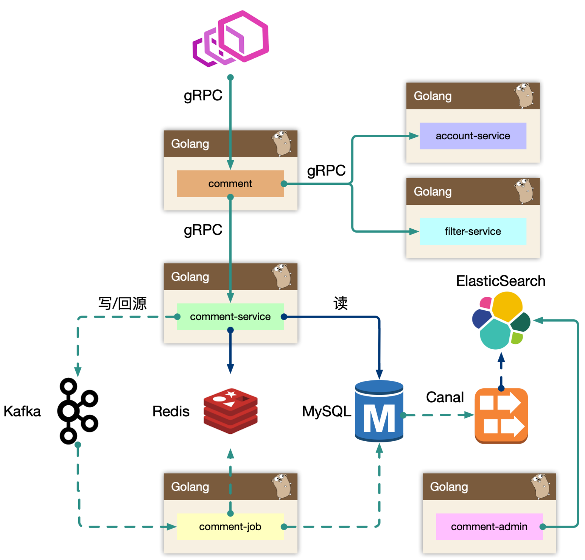
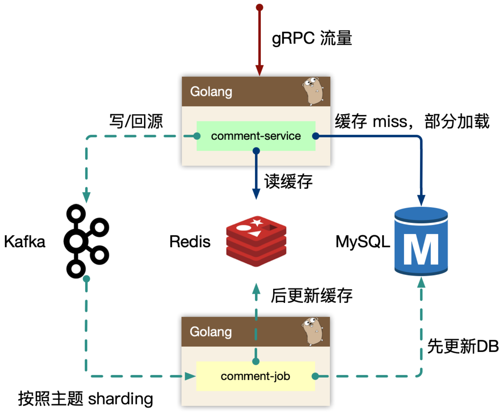
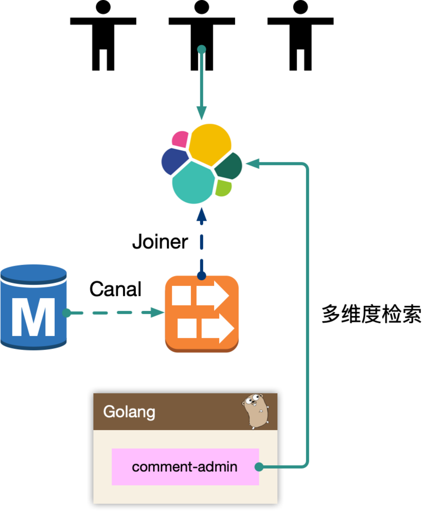
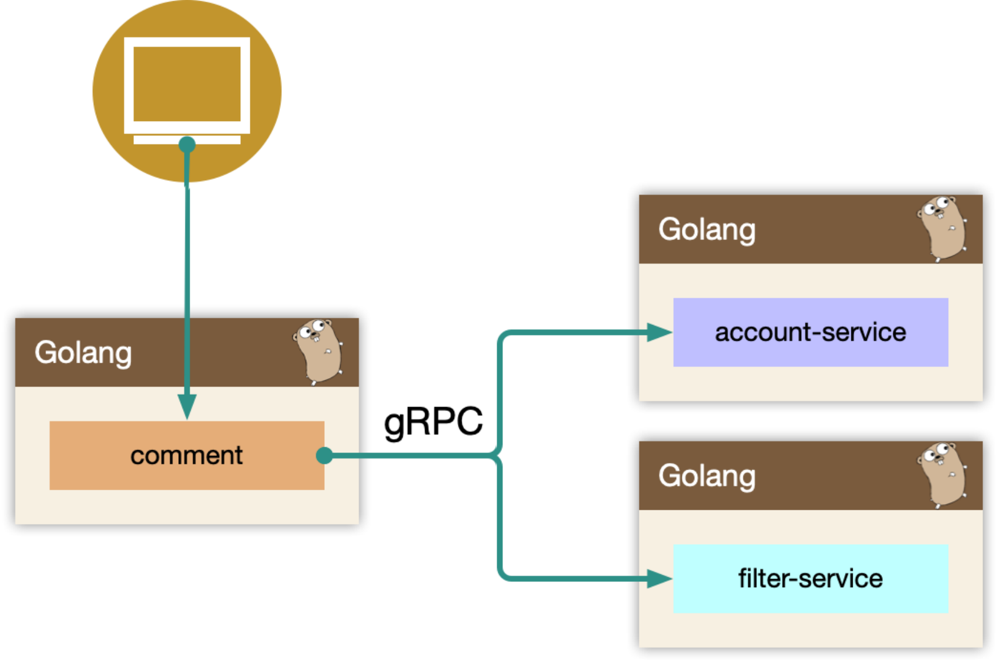
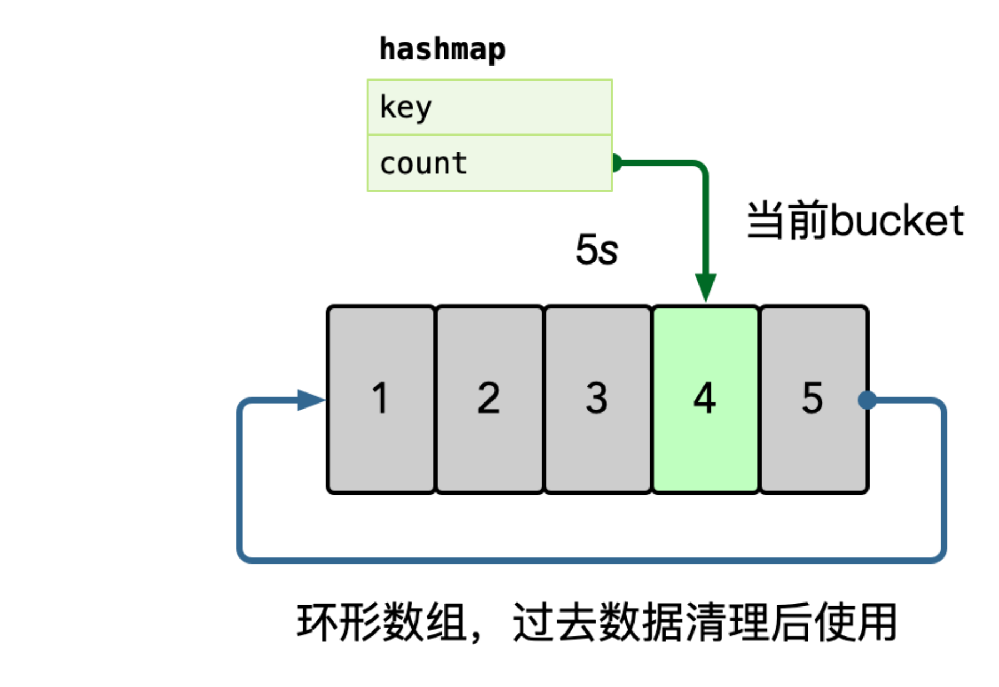

学习笔记
---
# 评论系统架构设计
## 功能模块
架构设计最重要的就是理解整个产品体系在系统中的定位。
搞清楚系统背后的背景，才能做出最佳的设计和抽象。
**不要做需求的翻译机，先理解业务背后的本质，事情的初衷。**

> 在动手设计前，反复思考，真正编码的时间只有5%。

* 发布评论: 支持回复楼层、楼中楼。
* 读取评论: 按照时间、热度排序。
* 删除评论: 用户删除、作者删除。
* 管理评论: 作者置顶、后台运营管理(搜索、删除、审核等)。

## 架构设计
### 概览

* BFF 层：`comment`  
  复杂评论业务的服务编排，比如访问账号服务进行等级判定，
  同时需要在 BFF 面向移动端/WEB场景来设计 API，
  这一层抽象把评论的本身的内容列表处理(加载、分页、排序等)进行了隔离，关注在业务平台化逻辑上。
* Service 层： `comment-service`  
  服务层，去平台业务的逻辑，专注在评论功能的 API 实现上，比如发布、读取、删除等，
  关注在稳定性、可用性上，这样让上游可以灵活组织逻辑把基础能力和业务能力剥离。
  
  * 读请求先查 Redis，Cache miss 再查 MySQL。Cache-Aside。
  * 写请求发给 Kafka ，交由下游的 `comment-job` 负责写入数据库、更新缓存
  * Cache miss 时，查 MySQL 的结果不更新 Redis ，而是向 Kafka 下发一条回源指令，
    委托 `comment-job` 进行 Cache reload。主要是防止 OOM 和 缓存不一致。
  * Cache miss 时，查询MySQL、下发回源指令消息时使用了 singleflight 单飞模式。
* Job 层：`comment-job`  
  消息队列的最大用途是消峰处理。  
  > 大量写的业务，系统瓶颈一定是在有状态的那层，通常是 RDBMS、KV等持久层
  
  消费 Kafka 消息，主要负责数据更新和 Cache Miss 回源处理。  
  只要 `comment-job` 节点足够多（Kafka 的 partition 也足够多），处理足够快，
  写请求的延迟几乎不会被感知到。
  客户端也可以在用户写评论后在客户端缓存，到页面刷新重新加载评论列表前，
  用户也几乎不会发现是异步写评论。
  
  通过 Kafka 的缓冲，可以有效保护持久层的 MySQL 不会被海量的写入请求压跨。
* 后台管理: `comment-admin`  
  管理平台，按照安全等级划分服务，尤其划分运营平台，他们会共享服务层的存储层(MySQL、Redis)。
  运营体系的数据大量都是检索，我们使用 canal 进行同步到 ES 中，
  整个数据的展示都是通过 ES，再通过业务主键更新业务数据层，
  这样运营端的查询压力就下方给了独立的 fulltext search 系统。

  MySQL 这样的 RDBMS 系统是 OLTP 联机事务处理型系统，不适合做数据分析、聚合这样的数据操作。
  管理后台中复杂沉重的查询不要直接使用 RDBMS 查询，几乎无法为这样的查询请求进行查询/索引优化。
  这种查询会对持久层构成压力甚至威胁，影响线上业务。
* Dependencies: `account-service`、`filter-service`  
  整个评论服务还会依赖一些外部 gRPC 服务，统一的平台业务逻辑在 `comment` BFF 层收敛，
  这里 `account-service` 主要是账号服务，`filter-service` 是敏感词过滤服务。

> 架构设计等同于数据设计，梳理清楚数据的走向和逻辑。尽量避免环形依赖、数据双向请求等。

### comment-service

专注在评论数据处理。**Separation of Concerns**

一开始是 `comment-service` 和 `comment` 是一层，
**业务耦合和功能耦合在一起，非常不利于迭代**，
当然在设计层面可以考虑目录结构进行拆分，但是架构层次来说，迭代隔离也是好的。

#### 读逻辑
Cache-Aside 模式，先读缓存，读不到再读取存储。

> 早期 cache rebuild 是做到 `comment-service` 里的，
> 对于重建逻辑，一般会使用 read ahead 的思路，即预读，
> 用户访问了第一页，很有可能访问第二页，所以缓存会超前加载，避免频繁 cache miss。
> 当缓存抖动时，特别容易引起集群 thundering herd 现象，
> 大量的请求会触发 cache rebuild，因为使用了预加载，容易导致服务 OOM

使用了消息队列来进行逻辑异步化，对于当前请求只返回 mysql 中部分数据即止。

#### 写逻辑
和读相比较，写可以认为是透穿到存储层的，系统的瓶颈往往就来自于存储层，或者有状态层。
对于写的设计上，我们认为刚发布的评论有极短的延迟(通常小于几 ms)对用户可见是可接受的，
把对存储的直接冲击下放到消息队列，按照消息反压的思路，
即如果存储 latency 升高，消费能力就下降，自然消息容易堆积，系统始终以最大化方式消费。

Kafka 是存在 partition 概念的，可以认为是物理上的一个小队列，
一个 topic 是由一组 partition 组成的，所以 Kafka 的吞吐模型理解为:
全局并行，局部串行的生产消费方式。
对于入队的消息，可以按照 hash(comment_subject) % N(partitions) 的方式进行分发。
那么某个 partition 中的 评论主题的数据一定都在一起，这样方便我们串行消费。

> 处理 Cache-miss 回源消息也是类似的思路

### `comment-admin`

一般来说，运营后台的检索条件都是组合的，
使用 es 的好处是避免依赖 mysql 来做多条件组合检索，
同时 mysql 毕竟是 oltp 面向线上联机事务处理的。
通过冗余数据的方式，使用其他引擎来实现。

mysql binlog 中的数据被 canal 中间件流式消费，
获取到业务的原始 C~~R~~UD 操作，回放录入到 es 中，
但是 es 中的数据最终是面向运营体系提供服务能力，需要检索的数据维度比较多，
在入 es 前需要做一个异构的 joiner，把单表变宽预处理好 join 逻辑，然后倒入到 es 中。

es 一般会存储检索、展示、primary key 等数据，
当我们操作编辑的时候，找到记录的 primary key，
最后交由 `comment-admin` 进行运营测的 CRUD 操作。

### `comment`

comment 作为 BFF，是面向端，面向平台，面向业务组合的服务。
所以平台扩展的能力，我们都在 comment 服务来实现，
方便统一和准入平台，以统一的接口形式提供平台化的能力。

* 依赖其他 gRPC 服务，整合统一平台测的逻辑(比如发布评论用户等级限定)。
* 直接向端上提供接口，提供数据的读写接口，甚至可以整合端上，提供统一的端上 SDK。
* 需要对非核心依赖的 gRPC 服务进行降级，当这些服务不稳定时。

## 存储设计
### 数据库设计
核心是三组表：`comment_subject_[0-49]`、`comment_index_[0-199]`、`comment_content_[0-199]`
* `comment_subject_[0-49]`

| 字段 | 类型 | 备注 | |
| :--- | :--- | :--- | :--- |
| id | int64 | 主键 | |
| obj_id | int64 | 对象 id | 评论的目标对象 id |
| obj_type | int8 | 对象类型 | 评论的目标对象类型，如视频、文章等。最多支持 128 种（通常达不到） |
| member_id | int64 | 对象作者用户 id | 评论的目标对象的作者用户 id，不是发出评论的用户 id |
| count | int32 | 评论总数 | 同时也是楼层数 |
| root_count | int32 | 根评论总数 | |
| all_count | int32 | 评论 + 回复总数 | |
| state | int8 | 状态 （0-正常、1-隐藏） | |
| attrs | int32 | 属性（bit 0-运营置顶 1-up置顶 2-大数据过滤）| 有32个位，可以存储32个布尔属性|
| create_time | timestamp | 创建时间 | |
| update_time | timestamp | 修改时间 | |

* `comment_index_[0-199]`

| 字段 | 类型 | 备注 | |
| :--- | :--- | :--- | :--- |
| id | int64 | 主键 | |
| obj_id | int64 | 对象 id | |
| obj_type | int8 | 对象类型 | |
| member_id | int64 | 发表者用户 id | |
| root | int64 | 根评论ID，不为0是回复评论 | |
| parent | int64 | 父评论ID，为0是 root 评论。 | |
| floor | int32 | 评论楼层 | 与 `comment_subject_[0-49]` 的 `count` 字段关联对应 |
| count | int32 | 评论总数 | |
| root_count | int32 | 根评论总数 | |
| like | int32 | 点赞数 | |
| hate | int32 | 点踩数 | |
| state | int8 | 状态（0-正常、1-隐藏） | |
| attrs | int32 | 属性 | 按位布尔开关 |
| create_time | timestamp | 创建时间 | |
| update_time | timestamp | 修改时间 | |

* `comment_content_[0-199]`

| 字段 | 类型 | 备注 | |
| :--- | :--- | :--- | :--- |
| comment_id | int64 | 主键 | 与 `comment_index_[0-199]` 主键对应。 |
| at_member_ids | string | @了哪些用户 | |
| ip | int64 | 发布评论客户端 ip | |
| platform | int8 | 发布评论客户端平台 | |
| device | string | 发布评论客户端设备类型 | |
| message | string | 评论内容 | |
| meta | string | 评论元数据：背景、字体 | |
| create_time | timestamp | 创建时间 | |
| update_time | timestamp | 修改时间 | |

> * 对 MySQL 来说，必须有主键，插入主键必须有序，
>   因为使用 B+ 树，如果主键不是有序插入，会导致页分裂，（非常）影响性能。
> * 基于 `obj_id` + `obj_type` sharding
> * 在 `comment_subject_[0-49]` 上记录评论数，避免在 `comment_index_[0-199]` 上 `count(*)`。
>   在事务中处理保证计数准确性。
> * 通常都会有 `create_time`、`update_time` 字段
> * `state` 字段进行标记隐藏删除，通常不会进行物理删除。
>   > 有些时候也有使用删除时间戳的方法（0未删除，非0删除时间戳）。
>   > 但会使用更多的空间，好处是方便应用唯一索引

数据写入: 事务更新 comment_subject，comment_index，comment_content 三张表，
其中 content 属于非强制需要一致性考虑的。 可以先写入 content，之后事务更新其他表。
即便 content 先成功，后续失败仅仅存在一条 ghost 数据。
> 为了保证写 `comment_index_[0-199]`.`floor` 正确，
> 需要先在同事务中查 `comment_subject_[0-49]`.`count`，
> 再查询时使用 `for update` 加行锁，保证其他事务在当前事务完成修改前不会读到这一行的值。

数据读取: 基于 obj_id + obj_type 在 comment_index 表找到评论列表，
WHERE root = 0 ORDER BY floor。
之后根据 comment_index 的 id 字段捞出 comment_content 的评论内容。
对于二级的子楼层，WHERE parent/root IN (id...)。  
因为产品形态上只存在二级列表，因此只需要迭代查询两次即可。
对于嵌套层次多的，产品上，可以通过二次点击支持。

**索引内容分离**

comment_index: 评论楼层的索引组织表，实际并不包含内容。
comment_content: 评论内容的表，包含评论的具体内容。
其中 comment_index 的 id 字段和 comment_content 是1对1的关系，这里面包含几种设计思想。
* 表都有主键，即 cluster index，是物理组织形式存放的，
  comment_content 没有 id，是为了减少一次 二级索引查找，
  直接基于主键检索，同时 comment_id 在写入要尽可能的顺序自增。
* 索引、内容分离，方便 mysql datapage 缓存更多的 row，
  如果和 context 耦合，会导致更大的 IO。
  长远来看 content 信息可以直接使用 KV storage 存储。
  
> 对移动端来说，翻页交互一定是使用瀑布流方式，接口使用游标查询，一定不能是按页码加载。
> 
> 只有PC端会使用翻页（深度翻页没有太好解决办法）。最好从产品交互设计上限制深度翻页。

> `comment_index` 和 `comment_content` 不仅是索引内容分离，同时也实现了动静分离。

### 缓存设计

* `comment_subject_cache` [string]

| part | type | comment |
|:---|:---|:---|
| key | string | cache_key。 oid_type。 object_id "_" object_type |
| value | bytes | subject marshal string |
| expire | duration | 24h |

对应主题的缓存，value 使用 protobuf 序列化的方式存入。
> 我们早期使用 memcache 来进行缓存，因为 redis 早期单线程模型，吞吐能力不高。

* `comment_index_cache` [sorted set]

| part | type | comment |
|:---|:---|:---|
| key | string | cache_key。oid_type_[sort]，其中 sort 为排序方式，0：楼层，1：回复数量 |
| member | int64 | comment_id，评论ID |
| score | double | 楼层号、回复数量、排序得分 |
| expire | duration | 8h |

使用 redis sortedset 进行索引的缓存，索引即数据的组织顺序，而非数据内容。  
Cache miss 的构建，是在 kafka 的消费者中处理，预加载少量数据，通过增量加载的方式逐渐预热填充缓存。  
redis sortedset skiplist 的实现，可以做到
O(logN) （找到开始位置） + O(M) （加载M条） 的查询时间复杂度，效率很高。

> sorted set 是要增量追加的，因此必须判定 key 存在之后才能 zdd。
> 
> 操作时序: exist -> zadd 不能保证 key 存在，可能在 exist 后 zadd 前，key 刚好过期。
> 应该使用时序：expire -> zadd。通过 expire 延长 key 的过期时间。
> 
> 过期剔除不一定是因为过期，可能是因为内存空间不足，按淘汰策略优先剔除了过期时间比较近的 key。
> 通过 expire “续命”，通常可以保证 key 不会被剔除。

* `comment_content_cache` [string]

| part | type | comment |
|:---|:---|:---|
| key | string | cache_key。comment_id |
| value | bytes | content marshal string |
| expire | duration | 24h |

对应评论内容数据，使用 protobuf 序列化的方式存入。类似的我们早期使用 memcache 进行缓存。

> 在通过 `comment_index_cache` 得到 id 集合后，使用 mget 从 `comment_content_cache`
> 批量取数据，不要使用反复 get 的方式。粗粒度获取。

> 增量加载 + lazy 加载。通常不会把所有数据都加载到缓存中，用户通常不会查看所有数据，
> 通常只 read ahead 从 cache miss 位置向后继续加载几页数据。
> 在读缓存时，发现读到 comment_index_cache 缓存末尾（不一定 Cache miss），
> 结合 comment_subject_cache 中floor 数可以判断是否需要继续加载还是 EOF。

## 可用性设计
### Singleflight 单飞、归并回源
> https://pkg.go.dev/golang.org/x/sync/singleflight

对于热门的主题，如果存在缓存穿透的情况，会导致大量的同进程、跨进程的数据回源到存储层，
可能会引起存储过载的情况。

使用归并回源的思路，同进程只交给一个人去获取 mysql 数据，然后批量返回。
同时这个 lease owner 投递一个 kafka 消息，做 index cache 的 recovery 操作。
这样可以大大减少 mysql 的压力，以及大量透穿导致的密集写 kafka 的问题。

更进一步的，后续连续的请求，仍然可能会短时 cache miss，
我们可以在进程内设置一个 short-lived flag，
标记最近有一个人投递了 cache rebuild 的消息，直接 drop。

> kafka go 客户端库 https://github.com/Shopify/sarama

> 不使用分页式锁的原因：
> * 太过复杂，容易出问题
> * 不方便调试

> 基于 MySQL 主从复制实现的读写分离，主从节点之前可能有短暂的不一致。
> 对于评论这样的对一致性要求没有那么高的系统可以采用。
> 主从复制的机制主要是为了备份，必要时进行主从切换故障恢复。

> ❗️ MySQL 驱动层限流， kratos

### 热点

> 将次要操作从主流程中分离出来，防止它的延迟、阻塞拖累主流程。
> 
> 如果没有强实时性要求，可以异步处理。kafka 或 订阅 binlog。

> 一个 key 的消费延迟会拖累它所在 kafka partition 所有的 key 的消费。  
> 可以通过 N 个子消息组并行消费同一 partition，对 partition 再 hash，减少影响面。
> 即从一个消息者消费一个 partition 所有 key 的1对1模型转换为
> 多个消息者分别消费一个 partition 中各自关注的 key 的 N对1模型
> （不关注的 key 直接 ack 跳过）。

流量热点是因为突然热门的主题，被高频次的访问，
因为底层的 cache 设计，一般是按照主题 key 进行一致性 hash 来进行分片，
但是**热点 key 一定命中某一个节点**，这时候 remote cache 可能会变为瓶颈，
因此**做 cache 的升级 local cache 是有必要的**，
我们一般使用单进程自适应发现热点的思路，附加一个短时的 ttl local cache，
可以在进程内吞掉大量的读请求。

> 应对热点，通常缓存需要多 replica 设计。

在内存中使用 hashmap 统计每个 key 的访问频次，这里可以使用滑动窗口统计，
即每个窗口中，维护一个 hashmap，之后统计所有未过去的 bucket，汇总所有 key 的数据。

之后使用小堆计算 TopK 的数据，自动进行热点识别。

---
# 扩展

> for + 闭包的 bug !!!。一定要通过传参或定义同名变量进行“屏蔽”  
> 参考：[Go语言核心36讲第05课](https://time.geekbang.org/column/article/13562) 、
> [Kratos v2 app.go](https://github.com/go-kratos/kratos/blob/v2/app.go#L110)

> Maglev Hash

> CDN、静态资源服务的域名不要与主站使用相同的顶级域名，避免同源。
> * 防止Cookie带到CDN服务器，形成安全风险。
> * 节省流量，防止同源 Http Header 占用 Http 流量。

> errors.Wrapf(errors.Internal("1001", "内部错误"), "query: %s error(%v)", sql, err)
> 
> 内部的 errors.Internal 用于 Unwrap 后 http/grpc 报错，外部 Wrapf 的内容则可以用于日志输出。

> repo 层，**一定不能忽略 rows.Err()**

> CodeReview:
> * 人员备份
> * 知识共享 && 教学工具
> * Peer Pressure，内部互相施压竞争、可以促进技能水平提升，同时也提高了代码质量。
> * Ownership 。主人翁意识，提高开发人员的责任心。

> 大仓 vs 分仓
> 大仓：方便统一版本，不容易分项目重复造轮子。坏处：不好做安全；编译工具要求比较高，否则编译速度会比较慢。
> 分仓：不好管控重复造轮子问题，不方便收拢错误、版本。不好推动基础库升级。
