学习笔记
---
# 微服务可用性设计
> 《The site Reliability Workbook 2 》  
> 《SRE Google 运维解密》《Google SRE 工作手册》

> 《代码整洁之道》

## 隔离
隔离，本质上是对系统或资源进行分割，从而实现当系统发生故障时能限定传播范围和影响范围，
即发生故障后只有出问题的服务不可用，保证其他服务仍然可用。

### 服务隔离  
#### 动静分离
小到 CPU 的 cache line **[false sharing](https://www.cnblogs.com/cyfonly/p/5800758.html)** 、
数据库 MySQL 表设计中避免 buffer pool 频繁过期，隔离动静表，
大到架构设计中的图片、静态资源等缓存加速。本质上都体现的一样的思路，
即加速/缓存访问变换频次小的内容。  
比如 CDN 场景中，将静态资源和动态API分离，也是体现了隔离的思路：
* 降低应用服务器负载，静态文件访问负载全部通过CDN。
* 对象存储存储费用最低。
* 海量存储空间，无需考虑存储架构升级。
* 静态CDN带宽加速，延迟低。

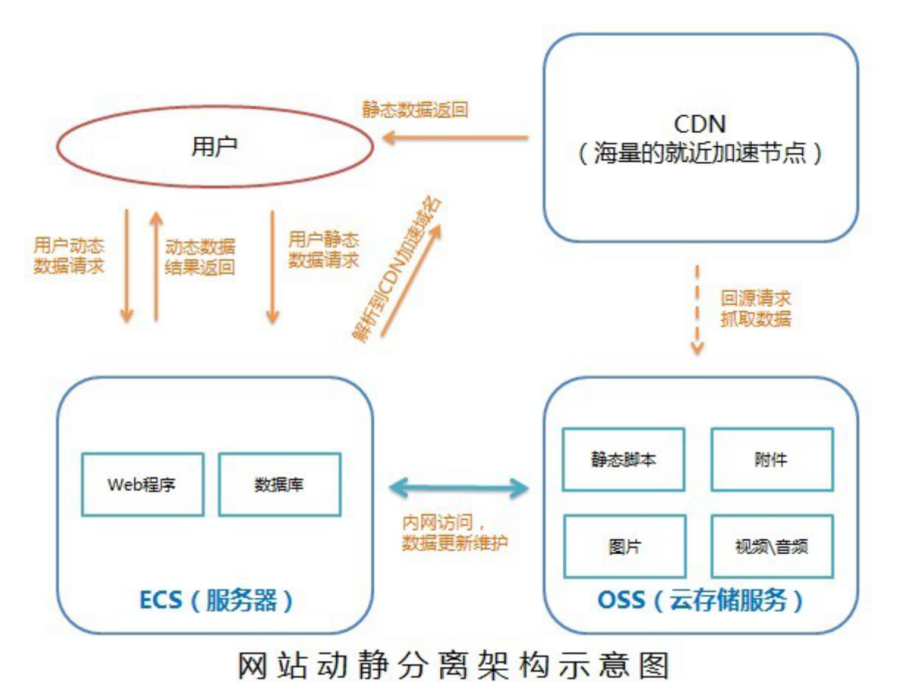

> 利用 （动态）CDN 的边缘计算能力，在数据收集/上报场景中，在 agent 上先行汇总数据，
> 再批量上报到机房 ECS 服务(扇入)，可以减少大量请求，减少大量网络建立断开的开销，
> 减少 ECS 节点，节省开支。边缘计算成本比较低。

#### 读写分离
主从、Replicaset、CQRS

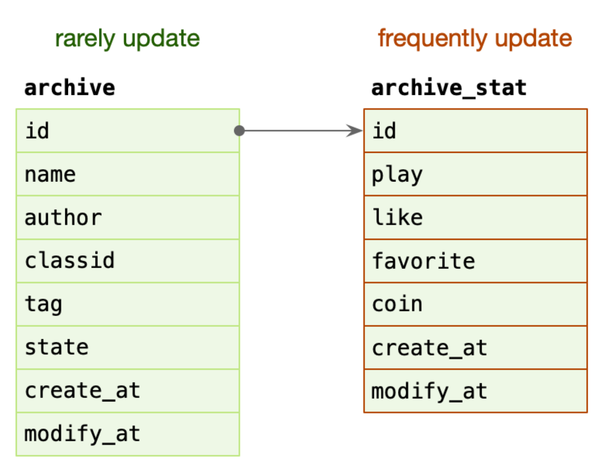

archive: 稿件表，存储稿件的名称、作者、分类、tag、状态等信息，表示稿件的基本信息。  
在一个投稿流程中，一旦稿件创建改动的频率比较低。

archive_stat: 稿件统计表，表示稿件的播放、点赞、收藏、投币数量，比较高频的更新。  
随着稿件获取流量，稿件被用户所消费，各类计数信息更新比较频繁。

MySQL BufferPool 是用于缓存 DataPage 的，DataPage 可以理解为缓存了表的行，
那么如果频繁更新 DataPage 不断会置换，会导致命中率下降的问题，
所以我们在表设计中，仍然可以沿用类似的思路，
其主表基本更新，在上游 Cache 未命中，透穿到 MySQL，仍然有 BufferPool 的缓存。

### 轻重隔离
#### 核心隔离
业务按照 Level 进行资源池划分（L0/L1/L2）。
* 核心/非核心的故障域的差异隔离（机器资源、依赖资源）。
* 多集群，通过冗余资源来提升吞吐和容灾能力。

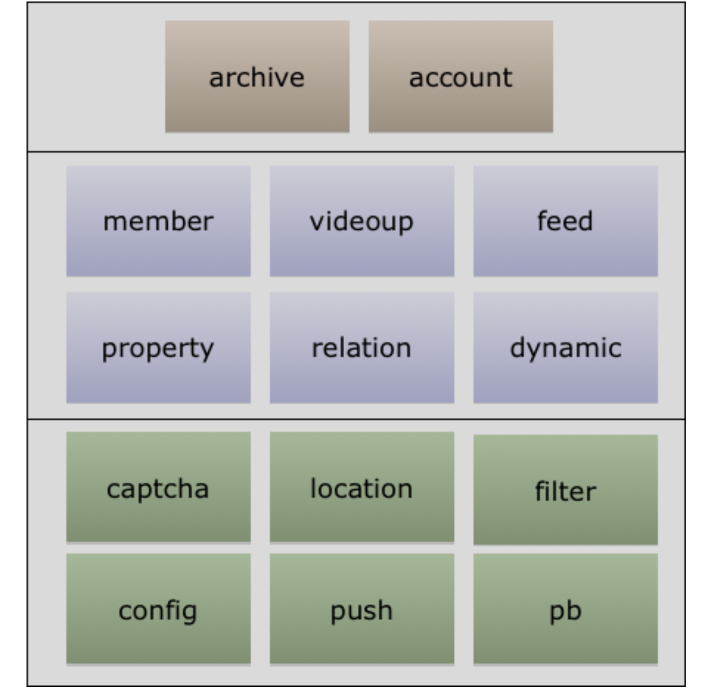

#### 快慢隔离

我们可以把服务的吞吐想象为一个池，当突然洪流进来时，池子需要一定时间才能排放完，
这时候其他支流在池子里待的时间取决于前面的排放能力，耗时就会增高，对小请求产生影响。

> 扩展：Kafak 设计上的缺陷：如果 partition 数过多，因为每个 partition 会生成一个日志文件，
> 太多的文件进行顺序写在全局上来看就退化为磁盘的随机写了，IO性能会急剧下降。
> 
> 如果设计上不得不将一个 topic 拆分成很多 partition ，可以考虑使用多套集群物理拆分，
> 在发布端进行 hash 将不同的 key 发布到不同的集群上。
> 尽量不要在同一套群集中拆分过多 partition。

日志传输体系的架构设计中，整个流都会投放到一个 kafka topic 中(早期设计目的: 更好的顺序IO)，
流内会区分不同的 logid，logid 会有不同的 sink 端，它们之前会出现差速，
比如 HDFS 抖动吞吐下降，ES 正常水位，全局数据就会整体反压。

按照各种纬度隔离：sink、部门、业务、logid、重要性(S/A/B/C)。

业务日志也属于某个 logid，日志等级就可以作为隔离通道。

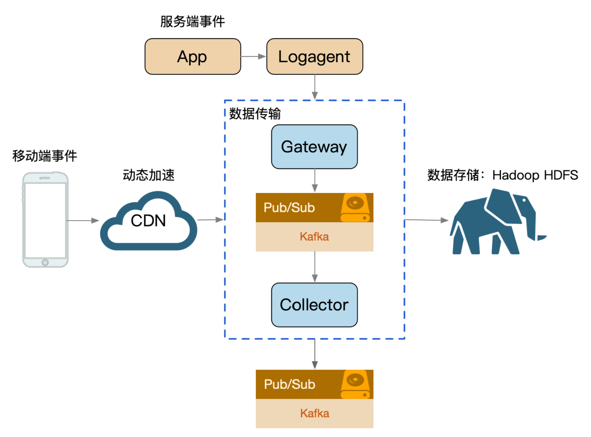

#### 热点隔离

热点即经常访问的数据。
很多时候我们希望统计某个热点数据访问频次最高的 Top K 数据， 并对其访问进行缓存。  
比如：
* 小表广播：从 remote cache 提升为 local cache，app 定时更新，
  甚至可以让运营平台支持广播刷新 local cache。 (使用 atomic.Value)
  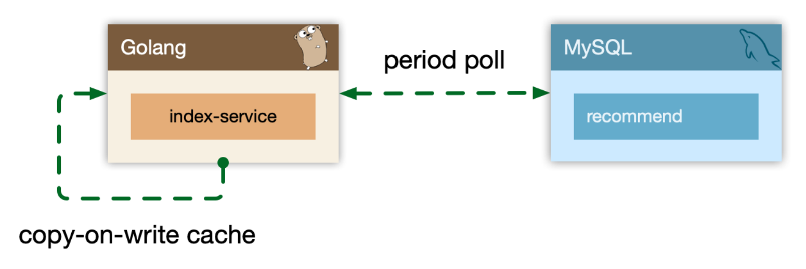
* 主动预热：比如直播房间页高在线情况下 bypass 监控主动防御。
  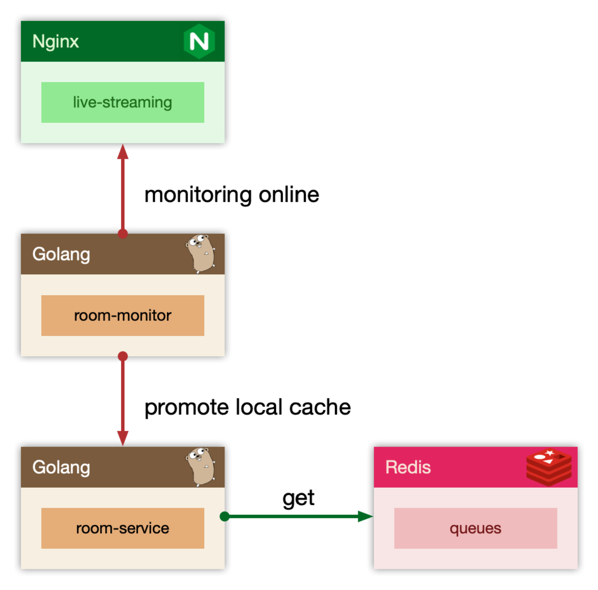

### 物理隔离  
#### 线程隔离（非Go语言）
> 对于 Go 来说，所有 IO 都是 Nonblocking，且托管给了 Runtime，
> 只会阻塞Goroutine，不阻塞 M（即线程），我们只需要考虑 Goroutine 总量的控制，
> 不需要线程模型语言的线程隔离。

主要通过线程池进行隔离，也是实现服务隔离的基础。
把业务进行分类并交给不同的线程池进行处理，当某个线程池处理一种业务请求发生问题时，
不会讲故障扩散和影响到其他线程池，保证服务可用。

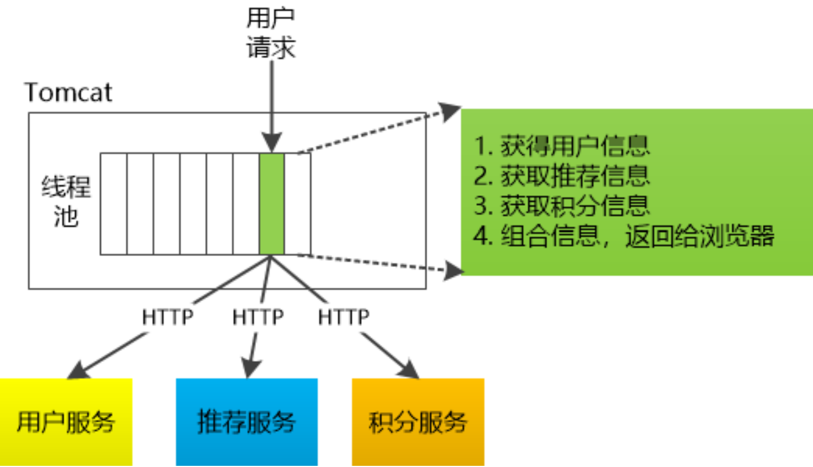
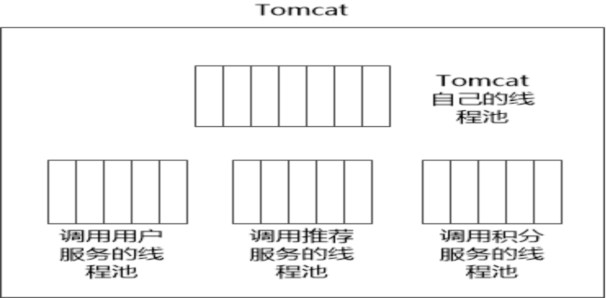
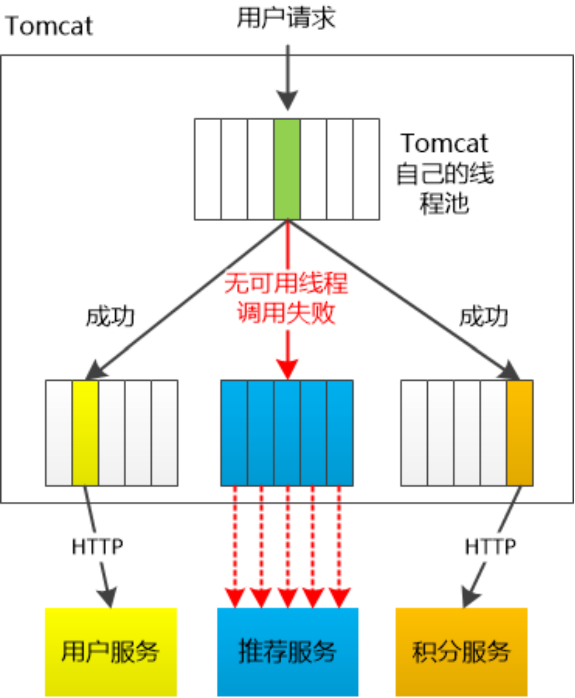
> 局部失败，Fail fast，进行降级兼容

> Java 除了线程池隔离，也有基于信号量的做法。
> 
> 传统基于线程池的做法：
> 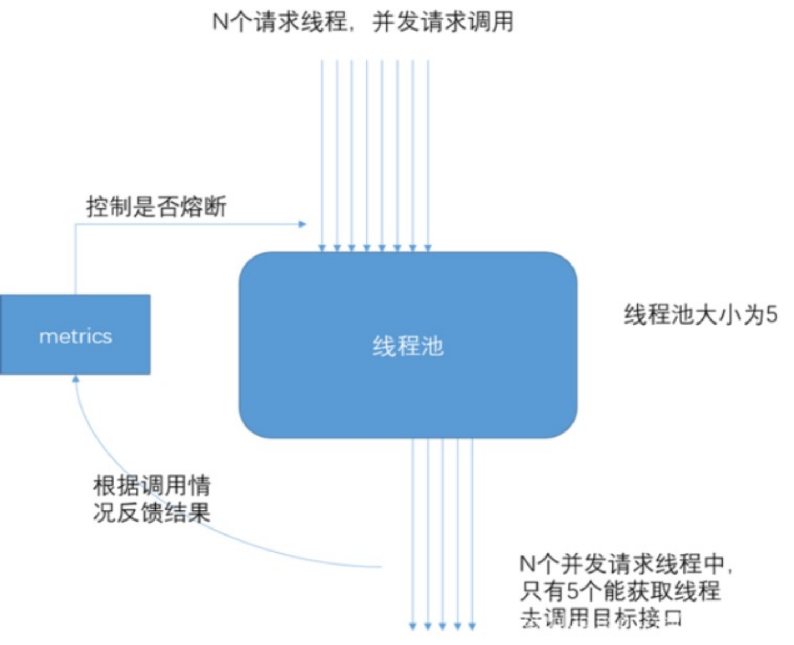
> 当线程池达到 maxSize 后，再请求会触发 fallback 接口进行熔断。
> 基于信号量：
> 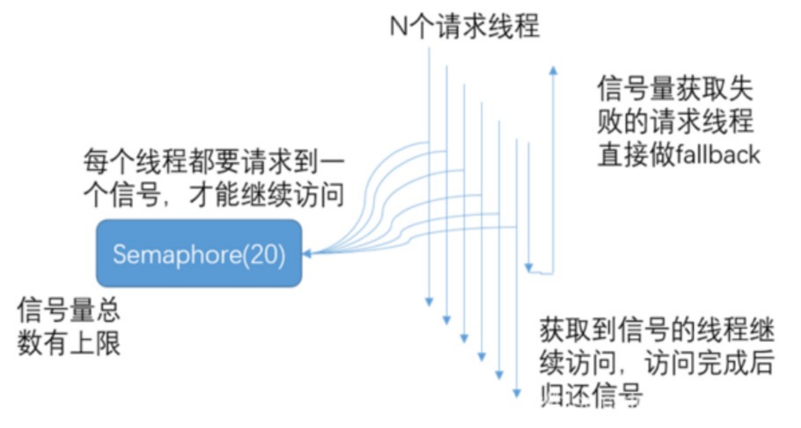
> 当信号量达到 maxConcurrentRequests 后，再请求会触发 fallback。
> 
> 灵魂拷问：信号量或线程池大小基于什么指标设定？Magic Number...

#### 进程隔离
主要是基于容器化（docker）和容器编排引擎（k8s）。

B站 15 年在 KVM 上部署服务；
16年使用 Docker Swarm；
16年下半年开始迁移到 Kubernetes，到17年底在线应用就全托管了，
之后很快在线应用弹性公有云上线；
20年离线 Yarn 和 在线 K8s 做了在离线混部(错峰使用)，
之后计划弹性公有云配合自建 IDC 做到离线的混合云架构。

#### 集群隔离 & 机房隔离
回顾 gRPC，我们介绍过多集群方案，即逻辑上是一个应用，物理上部署多套应用，通过 cluster 区分。

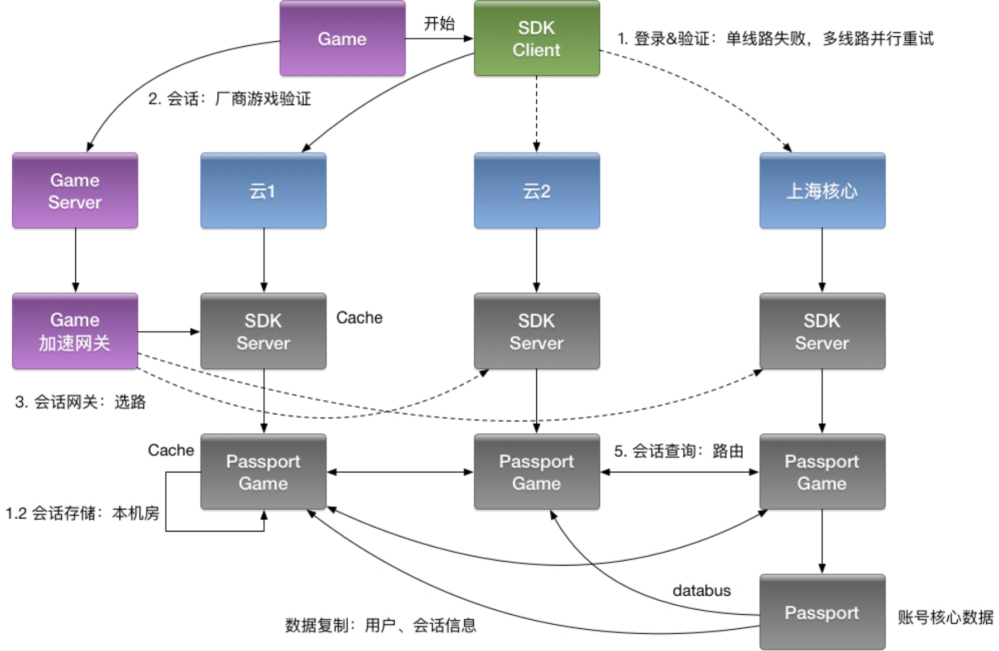
多活建设完毕后，我们应用可以划分为： region.zone.cluster.appid

### 案例
#### Case 1
早期转码集群被超大视频攻击，导致转码大量延迟。

用户上传的高清视频需要被转码成不同分辨率的视频供不同网络、不同设备的用户观看。

攻击者使用不同的账号上传大量重复内容组成的超大体积视频，将所有转码服务节点占用，
正常用户上传的普通大小视频迟迟得不到转码，大量任务被积压。

处理方式：应用轻重隔离的思想，将转码集群划分为多套集群，
分别处理大中小不同体积的视频内容，即使大体积视频转码任务积压也不会影响中小视频转码任务。

> 服务部分有损，全局可用。

#### Case 2
入口 Nginx(SLB) 故障，影响全机房流量。

问题，下游内部服务延迟，请求大量积压在 SLB 且 SLB没有灾备，最终 SLB Down 掉，服务全局不可用。

全局入口设备、基础设施要有灾备。可以按业务划分不同入口。

#### Case 3
缩略图服务，被大图实时缩略吃完所有 CPU，导致正常的小图缩略被丢弃，大量 503。

Gif 格式文件任务吃掉了其他格式的资源，
与案例1解决方法类似，为 Gif 格式文件隔离出独立的服务集群，并使用弹性扩缩容。

#### Case 4
数据库实例 cgroup 未隔离，导致大 SQL 引起的集体故障。

使用物理机部署 MySQL （基于性能考虑），但在同一台物理机上部署了多个 MySQL Daemon。
其中某个实例因为大 SQL 导致占用了物理机的所有 CPU、IO，导致其他实例性能抖动或不可用。

为各个实例加 Cgroup 限制。

> 不使用多个物理机分别单独部署 MySQL Daemon 是基于成本的考虑，
> 机房托管，占用的机位越少成本越低。

#### Case 5
INFO 日志里过大，导致异常 ERROR 日志采集延迟。

按日志级别，将日志分散到不同的 topic 采集。

## 超时控制
### 概述
Fail Fast，没有什么比挂起的请求和无响应的界面更令人失望。  
无意义的等待超时不仅浪费资源，而且还会证用户体验变得更差。  
我们的服务是互相调用的，所以在这些延迟叠加前，应该特别注意防止那些超时的操作。
* 网路传递具有不确定性。  
  连接超时、写超时、读超时，一个都别错配，少配一个都可能“炸”
  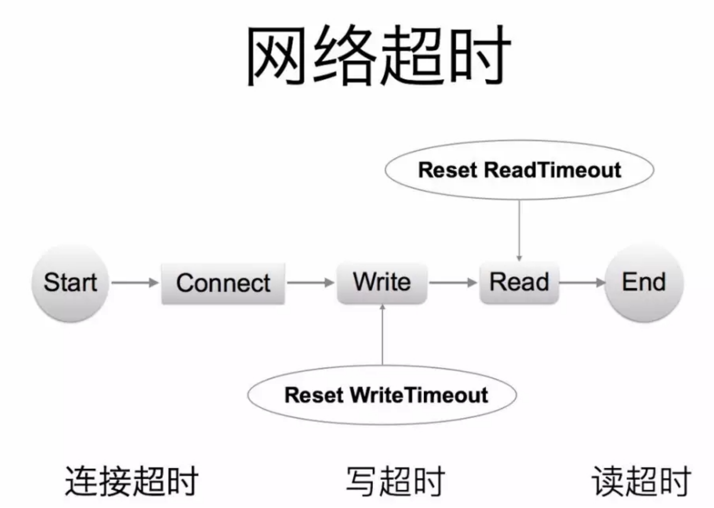
* 客户端和服务端不一致的超时策略导致资源浪费。  
  客户端1s超时，服务端2s超时，请求后1s，客户端认为超时，报错返回，
  但服务端还会再执行1s才发现超时，形成浪费
* “默认值”策略  
  Kit 库要提供一个合理的默认值，最好对明显不合理的超时配置有一定检测能力，防止错配。
* 高延迟服务导致 client 浪费资源等待，使用超时传递：进程内传递 + 跨进程传递。

> 超时控制是微服务可用性的第一道关，良好的超时策略，可以尽可能让服务不堆积请求，
> 尽快清空高延迟的请求，释放 Goroutine。

> 只有服务不挂，才有机会执行各种降级、容错、熔断策略，如果服务挂了，什么都白搭。

### 超时契约
实际业务开发中，依赖的微服务的超时策略并不清楚，或者随着业务迭代耗时发生了变化，
意外的导致依赖者出现了超时报错。

如服务 A 依赖服务 B，B 约定了95%响应一定可以在 200ms 内返回 ，
A 按照 B 的保证配置了 200ms 的调用超时，
但随着 B 的迭代，响应时间越来越长，A 服务开始大量报错。

> * SLI 服务质量/水平指标
> * SLO 服务质量/水平目标
> * SLA 服务质量/水平协议/保证

君子协定：
服务提供都定义好 latency SLO，更新到 gRPC 的 proto 定义中，
服务的后续迭代都应保证SLO。
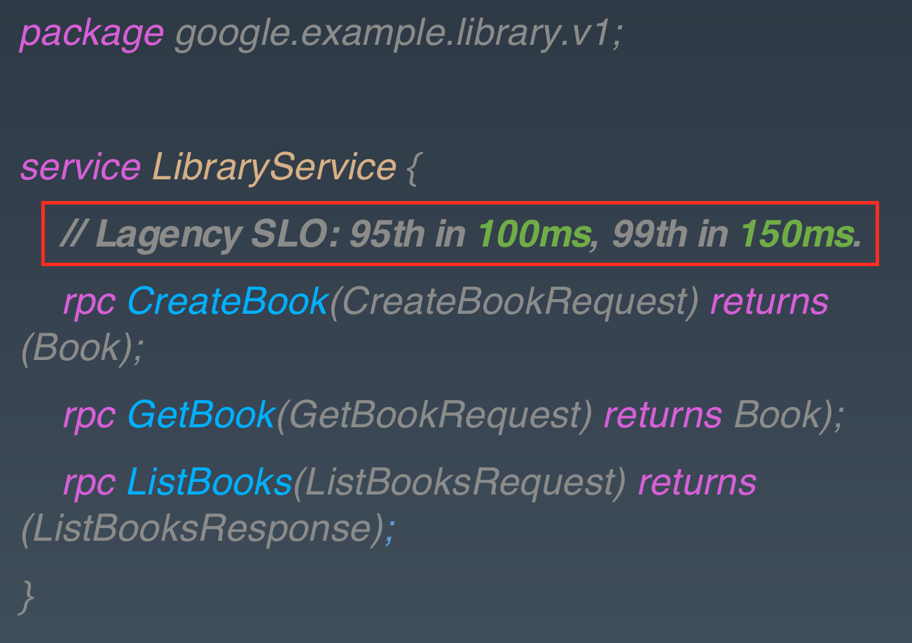

### 避免意外配置
避免出现意外的默认超时策略，或者意外的配置超时策略。
* kit 基础库兜底默认超时，比如 100ms，进行配置防御保护，避免出现类似 60s 之类的超大超时策略。
* 配置中心公共模版，对于未配置的服务使用公共配置。

### 超时传递
当上游服务已经超时返回504，但下游服务仍然在执行，会导致浪费资源做无用功。  
超时传递指的是把当前服务的剩余 Quota 传递到下游服务中，接力超时策略，控制请求级别的全局超时控制。

#### 进程内超时传递
一个请求在每个阶段（网络请求）开始前，就要检查是否还有足够的剩余来处理请求，
以及继承他的超时策略。

使用 Go 标准库的 context.WithTimeout。
```
func (c *asiiConn) Get(ctx context.Context, key string) (result *Item, err error) {
	c.conn.SetWriteDeadline(shrinkDeadline(ctx, c.writeTimeout))
	if _, err = fmt.Fprintf(c.rw, "gets %s\r\n", key); err != nil {
...
```
[shrinkDeadline](https://github.com/go-kratos/kratos/blob/master/pkg/cache/redis/util.go#L8)

#### 服务间超时传递
gRPC 不仅支持超时传递还支持级联取消。

在 gRPC 框架中，会依赖 gRPC Metadata Exchange，
基于 HTTP2 的 Headers 传递 grpc-timeout 字段，
自动传递到下游，构建带 timeout 的 context。

在需要强制执行时，下游的服务可以覆盖上游的超时传递和配额。

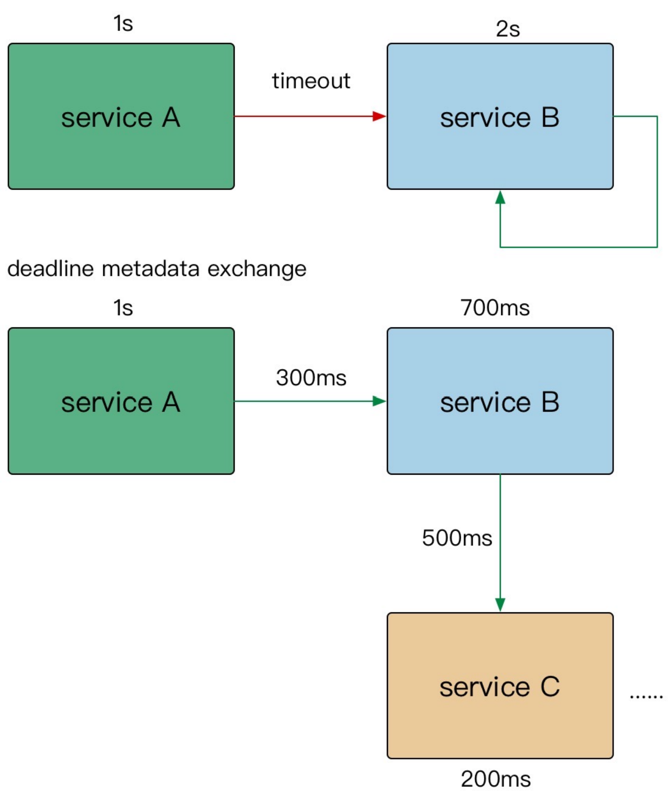

### 经验
* 双峰分布: 95%的请求耗时在100ms内，5%的请求可能永远不会完成(长超时)。
* 对于监控不要只看mean，可以看看耗时分布统计，比如 95th，99th。
* 设置合理的超时，拒绝超长请求，或者当Server 不可用要主动失败。

> 超时意味着服务线程耗尽，对于Go语言来说会导致 Goroutine 堆积，引发 OOM。

### 案例
#### Case 1
SLB 入口 Nginx 没配置超时导致连锁故障。

没有配置 proxy_timeout。

现在固定配置 1s 超时 504

#### Case 2
服务依赖的 DB 连接池漏配超时，导致请求阻塞，最终服务集体 OOM。

很多连接池实现，在调用者请求连接池获取连接时，默认超时等待为0，即不超时。
当连接池中没有可用连接、且连接数已达最大时，大量 Goroutine 阻塞在获取连接方法，最终 OOM。

获取连接时使用一个较短的超时时间如100ms或没有可用连接时直接报错。 Fail Fast。  
在选用连接池时，优先选择接收 context 、接受 context 超时控制的实现。

#### Case 3
下游服务发版耗时增加，而上游服务配置超时过短，导致上游请求失败。

广告服务，需要调用广告库存，广告库存需要请求很多外围广商的接口进行广告竞价，响应时间不可控。

没什么太好的办法，只能商务上要求外围广商保证接口 SLO 。

## 过载保护
## 限流
## 降级
## 重试
## 负载均衡
## 最佳实践


